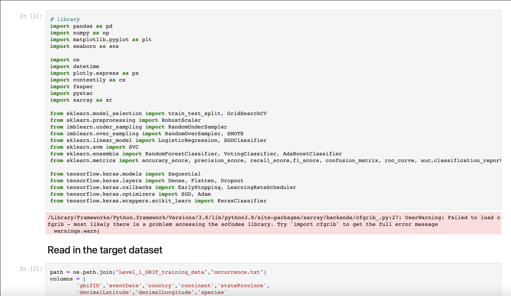

# EY_BWW_Data_challenge

## Local Frog Discovery notebook

### Challenge Overview

* This challenge is to predict the occurrence of a single species of frog for a single location using a single data source at a coarse spatial resolution.
* The output will be a species distribution model of one species of frog. Species distribution models are one of the most widely used ecological tools, a cornerstone in many countries worldwide of environmental regulation and conservation.
* Why frogs? Frogs are an indicator species. This means they are a go-to for scientists wanting to find out more about the environmental health of a particular ecosystem.
* Because they have permeable skin, frogs are very sensitive to pollutants, and because they can live on both land and in the water, they are a good indicator of the health of these two different environments.
* Frogs are poorly served by existing species distribution models. They have very localized distributions, more restricted than suggested by a potentially suitable habitat, and therefore existing models struggle to represent their range accurately.
* As indicators of ecological health and proxies for biological diversity, the disappearance of frogs is of great concern. Where frogs occur, we see healthy, thriving, resilient ecosystems. Where frogs have disappeared, we see ecosystems in poor health. All the 2030 Sustainable Development Goals (SDGs) are underpinned by healthy ecosystems. This means we won’t reach our goals if we don’t prevent and reverse the loss of healthy ecosystems.
* By joining this challenge, you are part of an important community who have decided to engage in activism using space tech and AI to monitor biodiversity at scale. Monitoring is key to prioritizing actions intended to protect and restore biodiversity.
* The estimated time effort this level requires is approximately 16 hours.

### Dataset used in this project includes: 

* For Target variable - Frog occurrence datasets (Australia)
* For Predictor variables - TerraClimate dataset (Climatic variables) available on Microsoft Planetary Computer portal. **https://planetarycomputer.microsoft.com/dataset/terraclimate**

### For challenge evaluation: 
* A score out of 1.0 will be generated based on the F1 performance metric.
* Participants will be evaluated on the extent to which they improve the accuracy of an existing model.

### About notebooks: 
#### Notebook will includes: 

1. Getting the data 
2. Data analyst and Data Cleaning 
3. Data Engineering 
4. Machine learning model 
5. Predicting the dataset 

#### Machine learning model used in this notebook to make prediction includes: 
* Logistic regression 
* Support Vector Classifier 
* RandomForest Classifier 
* Voting Classifier 
* AdaBoost Classifier 
* Neural Network using Perceptron "# EY_data_challenge" 
